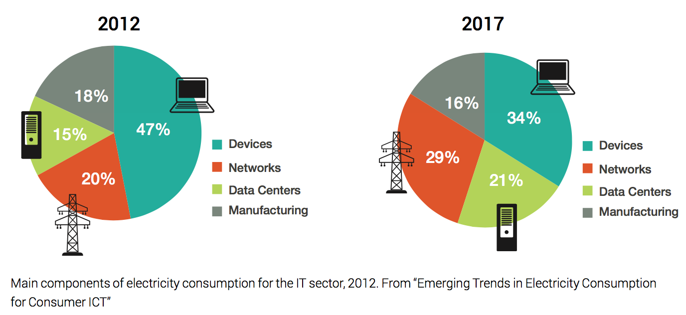
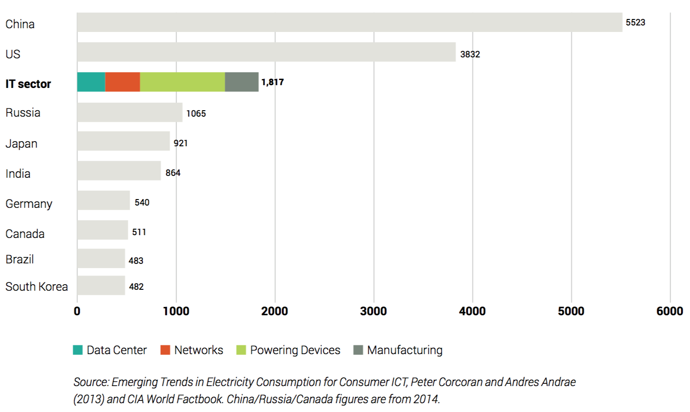

# Google y su compromiso con el cambio climático
En la actualidad el apetito insaseable del mundo por los mensajes, fotos, transmisión de video, junto con sistemas que respaldan las infraestructuras financieras, de transporte y de comunicación, propició el interés de los gigantes tecnológicos ([Google](https://www.google.com), [Facebook](https://www.facebook.com), [Microsoft](https://www.microsoft.com), [Apple](http://www.apple.com), etc.) por proveer plataformas ([facebook](https://www.facebook.com), [instagram](https://www.instagram.com/), [youtube](http://www.youtube.com), [snapchat](https://www.snapchat.com), [spotify](https://www.spotify.com/), [whatsapp](https://www.whatsapp.com/), etc.) adecuadas para facilitar el envío e intercambio de información a través de dispositivos electrónicos (smartphone, tablets, computadoras, etc.).

No es de extrañar, que se necesite una gran cantidad de energía para fabricar y alimentar los dispositivos electrónicos, centros de datos, redes de comunicación y en la propia manufactura de los equipos. De acuerdo con [Corcoran](https://www.researchgate.net/profile/Peter_Corcoran) y [Andrae](https://www.researchgate.net/profile/Anders_Andrae) en su artículo [Emerging Trends in Electricity Consumption](https://www.researchgate.net/publication/255923829_Emerging_Trends_in_Electricity_Consumption_for_Consumer_ICT) estiman que la demanda energética del sector de las TI consumiría alrededor del 7% en 2012, con  proyecciones que podrían exceder el 12% en el 2017, y que continuaría creciendo al menos un 7% anual hasta el 2030, es decir, el doble de la tasa promedio de crecimiento de la electricidad a nivel mundial. 

En ese mismo estudio, Corcoran y Andrae hacen una comparativa entre la demanda del sector de las TI con otros de los principales paises consumidores de energía. Como se ilustra en la siguiente gráfica, en el año 2012, el sector de las TI se encuentra sólo por debajo de China y Estados Unidos con 1,817 billones kWh.

Este crecimiento imparable de consumo digital está impulsando nuevas inversiones en infraestructura digital, en particular en Centros de Datos (fábricas de la actual economía digital) hambrientos de energía.

Según el sitio [Data Center Knowledge](http://www.datacenterknowledge.com/archives/2012/01/19/google-our-data-centers-are-good-neighbors/) "Google ha sido líder de la industria a la hora de revelar información sobre la eficiencia energética y el consumo de energía de sus centros de datos, así como sobre las estrategias para reciclar el agua con el objeto de reducir el impacto de sus instalaciones en comunidades locales". 

Por otra parte, según [Google Environmental Report](https://environment.google/) los centros de datos de google utilizan un 50% menos de energía que los centros de datos habituales. Es por esto, que varias empresas han empezado a utilizar aplicaciones de Google, con el fin de reducir gastos de cómputo, de electricidad, así como de emisiones de dióxido de carbono del 65% hasta un 85%. Asimismo, las empresas que utilizan Gmail han reducido su impacto medioambiental hasta un 98% con respecto a aquellas que ejecutan el correo electrónico en servidores locales. Por lo tanto, gracias a los esfuerzos de eficiencia energética de Google, la nube es mejor para el medio ambiente. Esto significa que las empresas que utilizan sus productos basados en la nube son también más ecológicas.

Internet probablemente sea la cosa más grande que construimos como especie. Con la tarea de crear y satisfacer el apetito insaciable del mundo por mensajes, fotos y transmisión de video, junto con sistemas críticos que respaldan nuestras infraestructuras financieras, de transporte y de comunicación, Internet sirve como el sistema nervioso central de la economía global moderna.
No es de extrañar, se necesita una gran cantidad de energía para fabricar y alimentar nuestros dispositivos, centros de datos y las necesidades de infraestructura relacionadas. Se estima que la huella energética del sector de TI consume alrededor del 7% de la electricidad global.1 Con un aumento previsto del triple del tráfico mundial de Internet para 20202, se espera que la huella energética de Internet aumente aún más, alimentada tanto por nuestro consumo individual de datos y por la difusión de la era digital a más de la población mundial, de 3 mil millones a más de 4 mil millones a nivel mundial. 3

como son las redes sociales (facebook, twitter, instagram, linkedin, etc),  ya sea a través de un tuit, mensaje de texto, whats app, <b>email</b>, o 
